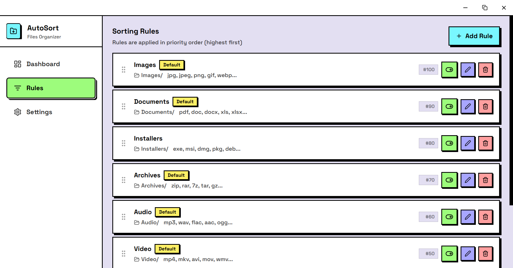
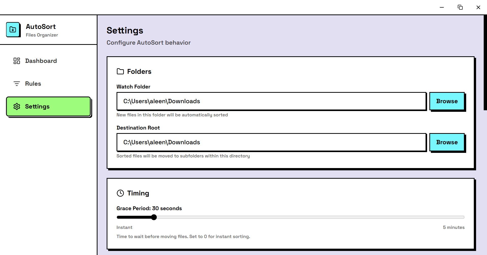

<div align="center">


# AutoSort

**Automatic file organizer for Windows**

Keep any folder clean with automatic file sorting based on custom rules.

[](https://github.com/AleenaTahir1/AutoSort/releases)
[](https://github.com/AleenaTahir1/AutoSort/actions)
[](LICENSE.txt)

</div>

---

## Screenshots

### Dashboard

<p align="center">
  
</p>

### Rules

<p align="center">
  
</p>

### Settings

<p align="center">
  
</p>

---

## Why AutoSort

Your Downloads folder has 847 unsorted files. PDFs, images, installers, random files everywhere. Finding anything is a nightmare.

AutoSort watches any folder you choose and automatically sorts files into organized subfolders based on your rules. Set it up once and never manually organize files again.

---

## Features

- **Auto-organize** — Files are automatically moved to the right folder based on extension, name, or size
- **Custom rules** — Create your own sorting rules with pattern matching
- **Grace period** — Files wait before moving, giving you time to cancel if needed
- **Real-time watching** — Monitors folders continuously for new files
- **One-time scan** — Instantly organize existing files with a single click
- **Undo support** — Accidentally moved something? Undo it instantly
- **Move history** — Track all file movements with full history
- **Dark theme** — Neo-brutalist UI with dark mode support
- **Any folder** — Works with Downloads, Desktop, or any folder you choose

---

## Installation

Download the latest release from the [Releases](https://github.com/AleenaTahir1/AutoSort/releases) page:

- **`.msi`** — Standard Windows installer (recommended)
- **`.exe`** — NSIS installer

---

## Usage

### Quick Start

1. **Set watch folder** — Go to Settings and select the folder to organize
2. **Configure rules** — Add rules for different file types (defaults included)
3. **Scan** — Click "Scan" to organize existing files
4. **Start** — Click "Start" to watch for new files automatically

### Default Rules

AutoSort comes with sensible defaults:

| Rule | Extensions | Destination |
|------|-----------|-------------|
| Images | `.jpg`, `.png`, `.gif`, `.webp`, `.svg` | `Images/` |
| Documents | `.pdf`, `.doc`, `.docx`, `.txt`, `.xlsx` | `Documents/` |
| Archives | `.zip`, `.rar`, `.7z`, `.tar`, `.gz` | `Archives/` |
| Installers | `.exe`, `.msi`, `.dmg` | `Installers/` |
| Videos | `.mp4`, `.mkv`, `.avi`, `.mov` | `Videos/` |
| Audio | `.mp3`, `.wav`, `.flac`, `.aac` | `Audio/` |

### Controls

| Button | Action |
|--------|--------|
| **Scan** | One-time scan of folder for existing files |
| **Start** | Begin watching for new files |
| **Stop** | Stop watching |
| **Pause** | Temporarily pause file moving |

---

## Development

### Requirements

- Node.js 18+ (or Bun)
- Rust 1.70+
- Tauri 2 system dependencies

### Run Locally

```bash
git clone https://github.com/AleenaTahir1/AutoSort.git
cd AutoSort
npm install
npm run tauri dev
```

### Build

```bash
npm run tauri build
```

### Project Structure

```
AutoSort/
├── src/                    # Frontend (React + TypeScript)
│   ├── components/         # UI components
│   │   ├── Dashboard/      # Main dashboard with stats
│   │   ├── Rules/          # Rule management
│   │   ├── Settings/       # App configuration
│   │   └── common/         # Shared components
│   ├── hooks/              # Custom React hooks
│   └── lib/                # Utilities and types
├── src-tauri/              # Backend (Rust)
│   ├── src/
│   │   ├── commands/       # Tauri IPC commands
│   │   ├── config/         # Configuration management
│   │   ├── engine/         # Sorting engine, rules, mover
│   │   └── watcher/        # File system watcher
│   └── capabilities/       # Tauri 2 permissions
└── package.json
```

---

## Tech Stack

- **Frontend** — React 18, TypeScript, Tailwind CSS
- **Backend** — Rust, Tauri 2
- **File Watching** — notify crate
- **UI Style** — Neo-Brutalist design
- **Build** — Vite

---

## License

This project uses a **Source Available** license. See [LICENSE.txt](LICENSE.txt) for details.

- Free for personal and educational use
- Free to modify for personal use
- Commercial use requires permission

---

## Author

**Aleena Tahir**

- GitHub: [@AleenaTahir1](https://github.com/AleenaTahir1)
- LinkedIn: [aleenatahir](https://www.linkedin.com/in/aleenatahir/)
